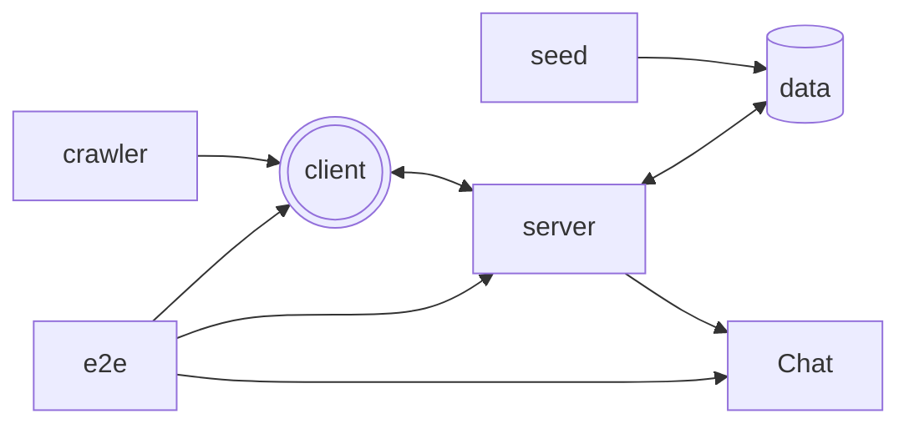

## SET UP

```mermaid
flowchart LR
  A[seed]
  B[(data)]
  C[server]
  D(((client)))
  E[e2e]
  F[crawler]
  G[Chat]
  A-->B
  C<-->B
  D<-->C
  E-->D
  E-->C
  E-->G
  F-->D
  C-->G
```

#

> docker-compose build

> docker-compose up

> docker-compose down

> docker-compose up --build
